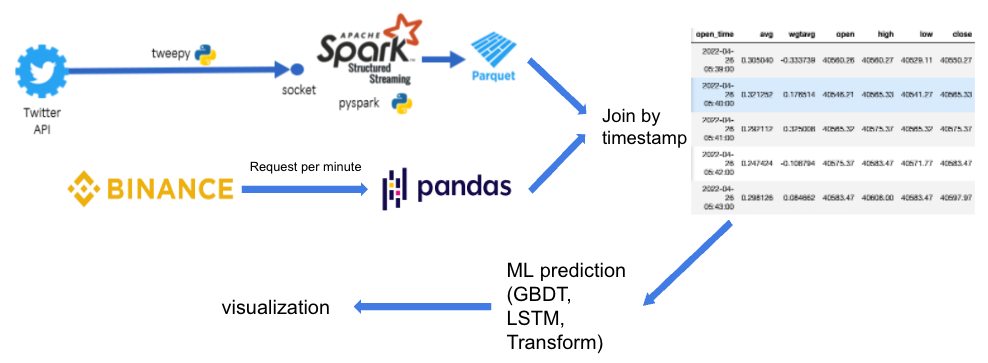
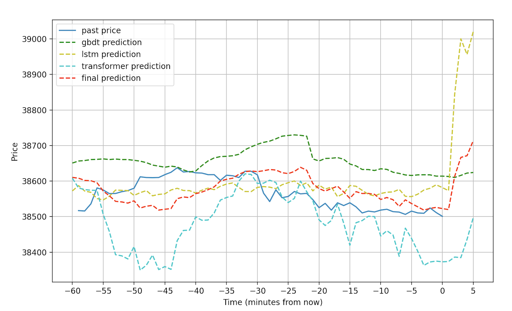

# Real-time Cryptocurrency Price Prediction

# online system


Here is the guideline to reproduce the online prediction pipeline in the local machine. 

1. firstly you need to install JAVA 8 to your local machine so that you can run pyspark. <br />
mac: https://www.oracle.com/java/technologies/downloads/#java8-mac <br />
linux: https://www.oracle.com/java/technologies/downloads/#java8-linux <br />
windows: https://www.oracle.com/java/technologies/downloads/#java8-windows <br />

2. To install all the dependencies in python
    ```
    pip install -r requirements.txt
    ```

3. open the notebook ``twitter_streaming_server.ipynb``, run all the code blocks. In the end you will see `Now listening on port: xxxx`, which means you successfully set up the Twitter streamming service.
4. open the notebook ``spark_streaming.ipynb``, run all the code blocks. Please remember to set up your JAVA 8 home directory `os.environ["JAVA_HOME"] = "..."` inside one code block. Then you had better wait for 60 minutes for spark to gather sentiment scores of 60 minutes.
5. To gather trading data from Binance, feed all the features into machine learning models, and visualize the results, just execute the python file below, the visualization would be updated every minute and show the historic price for past 60 minutes and predict price for the next 5 minutes.
    ```
    python main_final.py
    ```



# Methodologies
## Machine Learning - Decision Tree Ensembles
Codes implementing decision trees are stored in the folder _MachineLeanring_. There are four main code scripts:  
&emsp;&emsp;(1) ``GBDT_model_ns.ipynb``; (2) ``GBDT_model_s.ipynb``; (3) ``Xgboost_model_ns.ipynb``; (4) ``Xgboost_model_s.ipynb``.  

The first two scripts build GBDT models, and the other scripts two build Xgboost models. File name ended with "ns" indicates "no shulffling", which means training dataset is not shuffled but directly used in its original time order. File name ended with "s" indicates "shulffling", which means training dataset is shuffled.

In the folder _MachineLeanring_, we have another folder _Models_ that stores trained gbdt models. Those models are divided into two sets. One set is trained with twitter data, and the other is trained without twitter data. Only models trained with twitter data are loaded into the price prediction streaming. In other words, model files with format _"gbdt_m_minutes_later.pkl"_ are the most important ones.

Xgboost models are not stored in the folder _Models_ as we go with gbdt as our first choice and compare its perfomance with deep learning methods, but you can always train and save xgboost models with the provided code scripts. To train and save models, remember to adjust the following parameters:  
```
save_model = True
grid_search = True    # Optional

# If gird_search == True, it will try to find optimal hyperparameter combination. 
# If gird_search == False, it will go with default hyperparameter combination.
```

The script ``predict_strategy_compare.ipynb`` compares results of different training strategies. Generally, it compares peformance between:
(1) gbdt & xgboost models; (2) predict future price & predict difference between current price and future price; (3) with Twitter data & without Twitter data.


## Deep Learning - LSTM & Transformer

Codes implementing LSTM and Transformer models are stored in the folder _deeplearning_.

(1) ``LSTM_Transformer.ipynb``: Contains data preprocess & LSTM and Transformer models & whole training and test procedure offline.

(2) ``prediction.py``: Contains prediction functions of LSTM and Transformer models for online prediction.

(3) ``parameters_twt.pt``, ``transformer_twt.pt``: Save pre-trained parameters respectively for LSTM and Transformer models.

## Sample data are in the folder ``data``.
